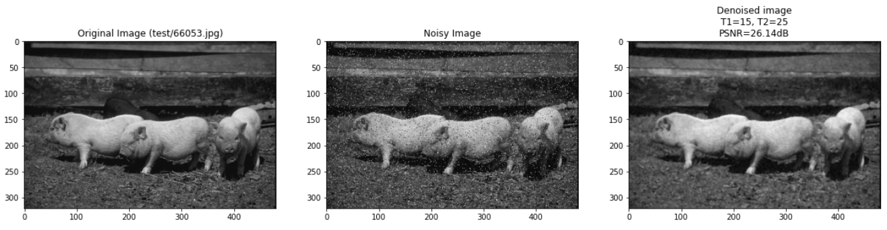

  This is a final project for the Digital Signal Processing course (ECE 313) at uWaterloo. It analyses the results
  of a given paper which describes an algorithm for denoising an image and performs some experiments to benchmark the algorithm's performance. For example,
  the image below shows the results of the basic denoising applied to an image of some pigs, and reports the resulting PSNR (Peak Signal to Noise Ratio):

  Most of the time on this one was spent getting the user interactivity to work and learning to use NumPy to implement the algorithm efficiently. This
  was also the first time I used Jupyter Notebooks for something other than a quick demo, so I learned a lot about that ecosystem.

