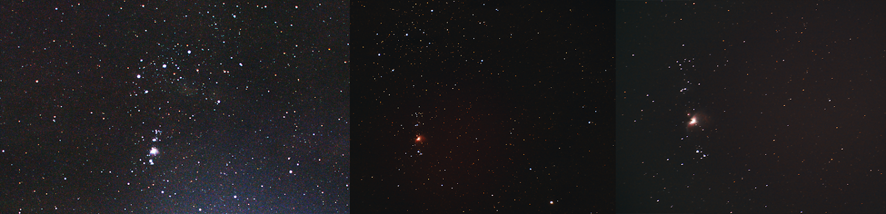

  In the winter of 2020 I took up astrophotography. I was taking <a href="https://uwflow.com/course/phys275" target="_blank">PHYS 275: Planets</a>
  which served as my motivation for learning more about our place in the solar system and the universe at large. Since I also have an interest in
  the technology of optics and photography, I decided my goal would be to get a good picture of a DSO using my Nikon D7100 DSLR, and found out that the Orion Nebula was a good candidate.
  This was also around the time of the <a href="https://www.wikiwand.com/en/Great_conjunction#/2020"> Great Conjunction </a> so I got to view that too. Below is a set of three images,
  taken a few months apart, that I took of the Orion Nebula.

  And below is the very first image I took; I had no idea what I was doing and mistook the shake in the camera
  for the rings of Saturn (not for long). On the top left is Saturn and the bottom right is Jupiter.

  Overall I learned a lot more than I thought I would. There's quite a few resources online that I found useful,
  and I learned a lot about the basics of image processing and how to use the DSLR to get the best results. Just a list
  of some of the things I used:
  <ul>
    <li> <a href="http://deepskystacker.free.fr/english/index.html" target="_blank"> DeepSkyStacker </a> </li>
    <li> <a href="https://pixinsight.com/" target="_blank">PixInsight</a> </li>
    <li> <b>The Astrophotography Manual</b> by Chris Woodhouse (2017) </li>
    <li> Photoshop CS6 (has some handy pre-processing tools e.g. lens calibration) </li>
    <li> The Camera Manual (it was very well written) </li>
  </ul>

  I could go on and on about the things I learned, and some day I might, but for now here's some more pictures.

 Mars (top middle) and a Galaxy (M81 I think). Took a lot of post-processing for this one hence the pink area on the
  bottom and vignetting on the top left.

 The Pleiades cluster. I hope to one day get a better shot of this, but I need better equipment first
  (planning on a mount like the Star Adventure Pro)

 Aldeberaan (the bright one) 

 My camera hooked into an Explore FirstLight 127mm Mak-Cas telescope. Too unstable for DSOs. 

